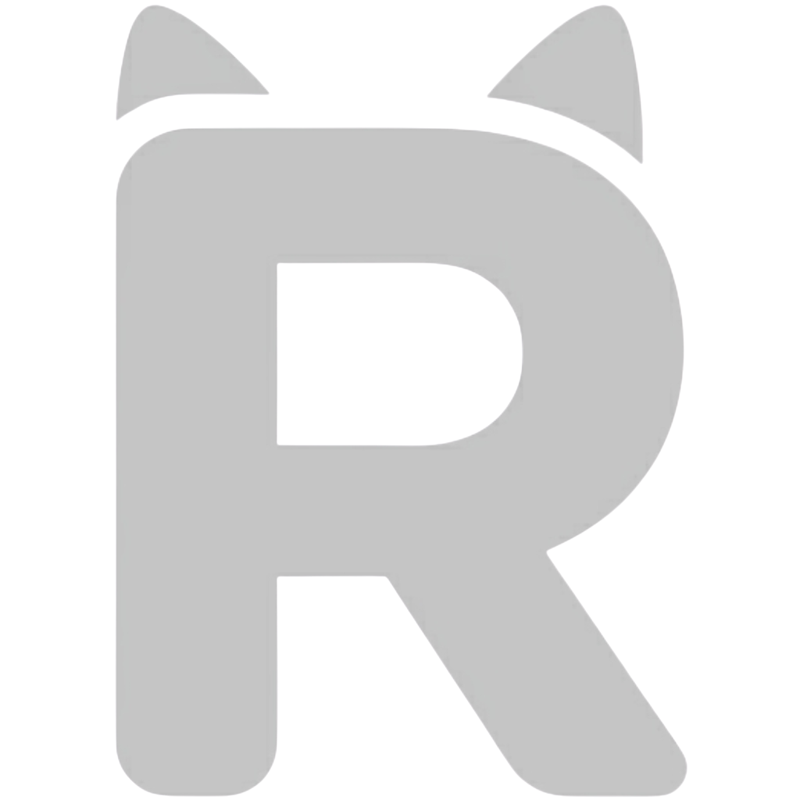

# Ragdoll

[](https://github.com/TheHenkelmann/ragdoll/actions/workflows/ci.yml)
[](https://codecov.io/gh/TheHenkelmann/ragdoll)
[](LICENSE)
[](https://github.com/TheHenkelmann/ragdoll/pkgs/container/ragdoll)

<div align="center">
  
</div>

**One-stop RAG pipeline in a single Docker container — local retrieval, optional BYO-LLM answers.**

Ragdoll combines a Rust query gateway, a Python ingest worker, libSQL with
embedded vectors, and local ONNX embedding/reranking models. Ingest, embed, search,
filter, and rerank run **fully on your hardware**. Answer generation is **opt-in**
per query via your own external LLM credentials (OpenAI, Azure, Vertex, …).

## What Ragdoll does

| Capability | Description |
|---|---|
| **Ingest** | Queue text, files (PDF, DOCX, …), or URLs; the worker extracts, Semantic-Split chunks, embeds, and stores vectors |
| **Retrieve** | Cosine vector search (optional hybrid BM25), hard metadata filters, cross-encoder rerank, citations |
| **Generate** | Optional BYO-LLM answers with streaming SSE ([docs/querying.md](docs/querying.md)) |
| **Filter** | Hard metadata filters *before* search (`meta.department`, `source_id`, nested keys, …) |
| **Version** | Releases hold content snapshots; stages point production traffic at a release |
| **Secure** | Fine-grained RBAC for users and API keys; rate limits per key |
| **Observe** | Per-query and per-ingest latency metrics, analytics aggregates, DB viewer |
| **Operate** | Web UI, backups, webhooks, ONNX model management, reindex |

```text
Client (UI / curl / SDK)
        │
        ▼
┌───────────────────────────────────────┐
│  Rust gateway (port 8080)             │
│  Auth · API · Search · Rerank · SPA   │
└───────────────┬───────────────────────┘
                │
     ┌──────────┴──────────┐
     ▼                     ▼
 libSQL (WAL)         Python worker
 sources/chunks       extract → semantic split → embed
 ingest_jobs          writes chunks + metrics
 queries/query_chunks
```

## Quick start

```bash
export RAGDOLL_SECRET=change-me-in-production
docker compose up --build
```

> **First start downloads ~2 GB of models** into the data directory.
> `/api/v1/health` reports `ready: false` until that finishes — this is normal.

Then, with the server ready:

```bash
# 1. Log in (default superadmin: admin@ragdoll.ai / admin)
TOKEN=$(curl -sS -X POST http://localhost:8080/api/v1/auth/login \
  -H 'Content-Type: application/json' \
  -d '{"email":"admin@ragdoll.ai","password":"admin"}' | jq -r .token)

# 2. Ingest one document (async — the worker processes it in the background)
curl -sS -X POST http://localhost:8080/api/v1/releases/first-release/sources \
  -H "Authorization: Bearer $TOKEN" -H 'Content-Type: application/json' \
  -d '[{"type":"text","name":"demo","content":"Ragdoll is a fully local RAG pipeline."}]'

# 3. Create an API key (queries require an API key, not a session token)
API_KEY=$(curl -sS -X POST http://localhost:8080/api/v1/api_keys \
  -H "Authorization: Bearer $TOKEN" -H 'Content-Type: application/json' \
  -d '{"name":"quickstart","permissions":["queries:run"]}' | jq -r .token)

# 4. Query it (poll the source until status=completed first)
curl -sS -X POST http://localhost:8080/api/v1/releases/first-release/queries \
  -H "Authorization: Bearer $API_KEY" -H 'Content-Type: application/json' \
  -d '[{"text":"what is ragdoll?","top_k":5}]'
```

Open `http://localhost:8080/` for the UI, or `…/api/v1/swagger-ui` for the API.

The full walkthrough — including the **first ingest and query step by step** — is
in [docs/getting-started.md](docs/getting-started.md).

## Documentation

The [docs/](docs/) folder is the reference manual; this README is the front door.

| You want to… | Read |
|---|---|
| Get running and run your first query | [docs/getting-started.md](docs/getting-started.md) |
| Understand releases, stages, and auth | [docs/concepts.md](docs/concepts.md) |
| Ingest files, URLs, and metadata | [docs/ingestion.md](docs/ingestion.md) |
| Tune chunk quality (Semantic Split) | [docs/chunking.md](docs/chunking.md) |
| Query with filters, rerank, and generation | [docs/querying.md](docs/querying.md) |
| Embedding & rerank models (ONNX) | [docs/models.md](docs/models.md) |
| Operate the UI, backups, analytics | [docs/operations.md](docs/operations.md) |
| Configure environment variables | [docs/configuration.md](docs/configuration.md) |
| Understand the architecture | [docs/architecture.md](docs/architecture.md) |
| **Avoid the common traps** | [docs/pitfalls.md](docs/pitfalls.md) |
| Try a runnable end-to-end example | [docs/tutorial/](docs/tutorial/data_ingestion_tutorial.ipynb) |

New to Ragdoll? Read [getting-started](docs/getting-started.md) →
[concepts](docs/concepts.md), then skim [pitfalls](docs/pitfalls.md).

## Deploy to cloud

Ragdoll is a **single-replica** container with persistent `/data` storage. See [deploy/README.md](deploy/README.md).

Image: `ghcr.io/thehenkelmann/ragdoll:latest`

**Master secret:** Cloud deploy templates generate a **random `RAGDOLL_SECRET` automatically**. It is not saved or shown to you after deploy. To use your own stable secret, set `export RAGDOLL_SECRET=...` before running a deploy script, or fill in the optional override parameter in Azure/AWS portal forms (parameter name: `secretOverride` / `SecretOverride`).

### Serverless (max 1 instance)

| Cloud | Deploy |
|---|---|
| GCP Cloud Run | [](https://shell.cloud.google.com/cloudshell/open?git_repo=https://github.com/TheHenkelmann/ragdoll&cloudshell_working_dir=deploy/gcp/cloud-run) then `./deploy.sh` |
| Azure Container Apps | [](https://portal.azure.com/#create/Microsoft.Template/uri/https%3A%2F%2Fraw.githubusercontent.com%2FTheHenkelmann%2Fragdoll%2Fmain%2Fdeploy%2Fazure%2Fcontainer-apps%2Fmain.json) |
| AWS App Runner | [`deploy/aws/app-runner/deploy.sh`](deploy/aws/app-runner/deploy.sh) |

### Simple instance (recommended for production)

| Cloud | Deploy |
|---|---|
| GCP Compute Engine | [](https://shell.cloud.google.com/cloudshell/open?git_repo=https://github.com/TheHenkelmann/ragdoll&cloudshell_working_dir=deploy/gcp/gce) then `./deploy.sh` |
| Azure Container Instances | [](https://portal.azure.com/#create/Microsoft.Template/uri/https%3A%2F%2Fraw.githubusercontent.com%2FTheHenkelmann%2Fragdoll%2Fmain%2Fdeploy%2Fazure%2Faci%2Fmain.json) |
| AWS ECS Fargate | [](https://console.aws.amazon.com/cloudformation/home?region=eu-central-1#/stacks/create/review?templateURL=https://raw.githubusercontent.com/TheHenkelmann/ragdoll/main/deploy/aws/ecs-fargate/template.yaml) |

## License

Ragdoll is licensed under **AGPL-3.0-only**.

If you modify Ragdoll and offer it as a network service, you must provide
corresponding source under AGPL Section 13, including the bundled management SPA.

See [LICENSE](LICENSE) and [CONTRIBUTING.md](CONTRIBUTING.md).
